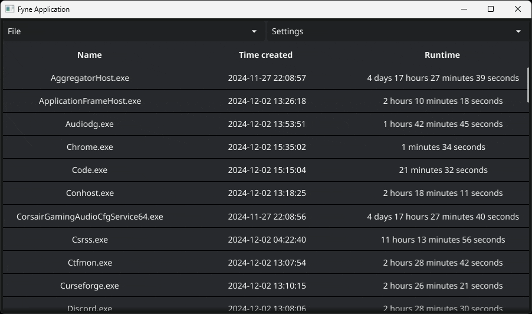
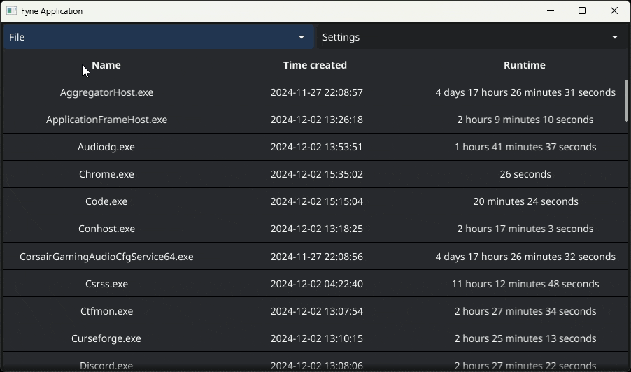
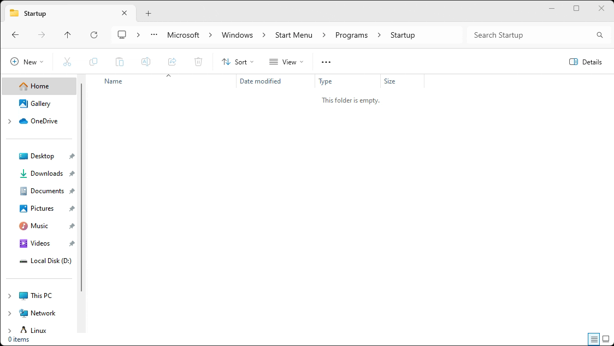
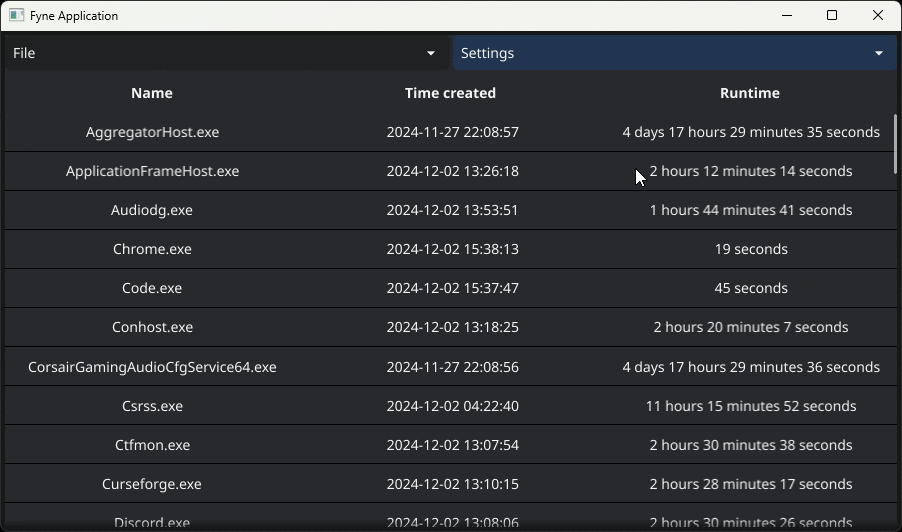
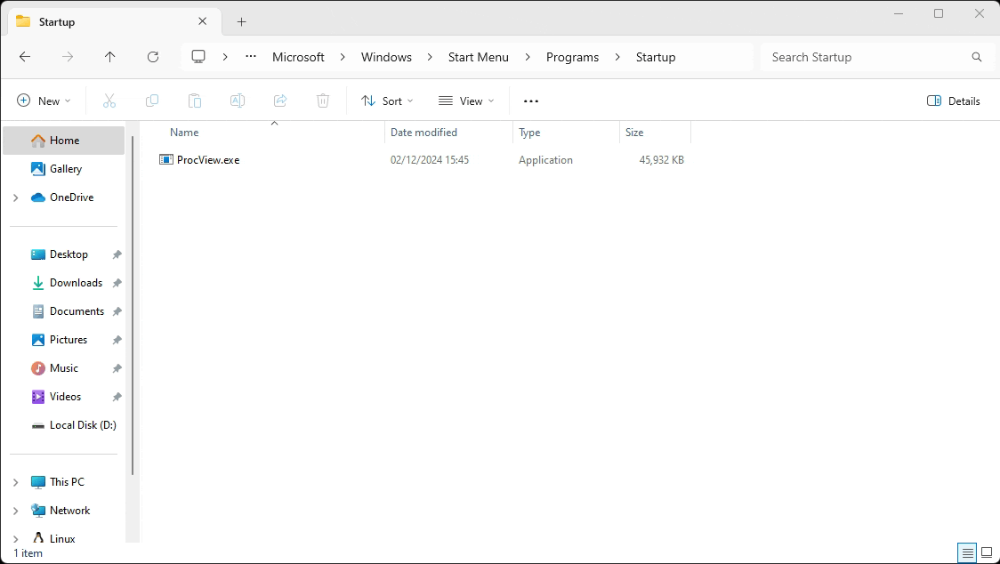
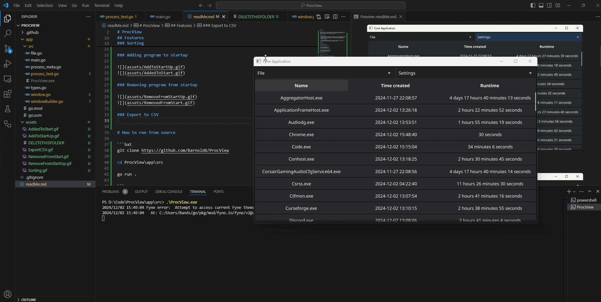

# ProcView

## Overview  

This app provides a simple Fyne-based GUI to display process statistics. The main window contains a list, where each item is divided into three subsections to present the relevant data for a specific process.  

## How It Works  

- **Data Gathering**:  
  Process statistics are collected in a separate thread to keep the window thread responsive. Data is retrieved using [Windows'](https://en.wikipedia.org/wiki/Microsoft_Windows) [WMIC](https://learn.microsoft.com/en-us/windows/win32/wmisdk/wmic) utility.  

- **Time Calculation**:  
  The app calculates elapsed time as the difference between the system clock's current time and the time when the application started.  

# How to run from source

```bat
git clone https://github.com/Barnold8/ProcView

cd ProcView\app\src

go run .

```

# How to build

```bat
git clone https://github.com/Barnold8/ProcView

cd ProcView\app\src

go build -o ProcView.exe

REM If you want to build without the console window (its very glitchy) use

go build -ldflags -H=windowsgui -o ProcView.exe

```

# How to run executable

```bat

./ProcView

start Procview

```

**This app does not require any args**


## Features

### Sorting



### Adding program to startup




### Removing program from startup




### Export to CSV



[](https://go.dev/)
[](https://en.wikipedia.org/wiki/Microsoft_Windows)

